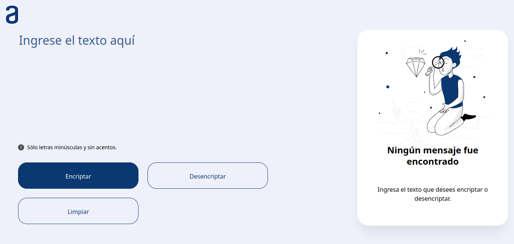

# 🔐 Encriptador de Texto - Challenge Oracle ONE

¡Bienvenido al proyecto **Encriptador de Texto**!  
Esta aplicación web fue creada como parte del **Challenge Oracle ONE - Alura Latam**, y permite encriptar y desencriptar mensajes usando una lógica sencilla de sustitución de letras. Es ideal para intercambiar mensajes secretos entre quienes conozcan la "clave" de encriptación.

---

## 🚀 ¿Qué hace esta app?

La aplicación permite:

- ⌨️ Ingresar un texto en minúsculas sin acentos ni caracteres especiales.
- 🔐 Encriptar el texto según una clave de sustitución específica.
- 🔓 Desencriptar el texto encriptado a su forma original.
- 📋 Copiar el texto resultante al portapapeles.
- 🔄 Restaurar el área de entrada para escribir un nuevo mensaje.

---

## 🧠 Lógica de Encriptación

Las siguientes sustituciones de letras se realizan para encriptar el texto:

| Letra original | Reemplazo |
| -------------- | --------- |
| `e`            | `enter`   |
| `i`            | `imes`    |
| `a`            | `ai`      |
| `o`            | `ober`    |
| `u`            | `ufat`    |

> ⚠️ **Importante:**
>
> - Solo se aceptan letras minúsculas.
> - No se permiten acentos ni caracteres especiales.

---

## 📸 Vista previa

<!-- Puedes reemplazar con una imagen real -->

---

## 🧩 Funcionalidades

- ✅ Encriptar texto en tiempo real.
- ✅ Desencriptar texto previamente encriptado.
- ✅ Copiar el texto resultante.
- ✅ Botón para limpiar el área de texto y comenzar de nuevo.

---
